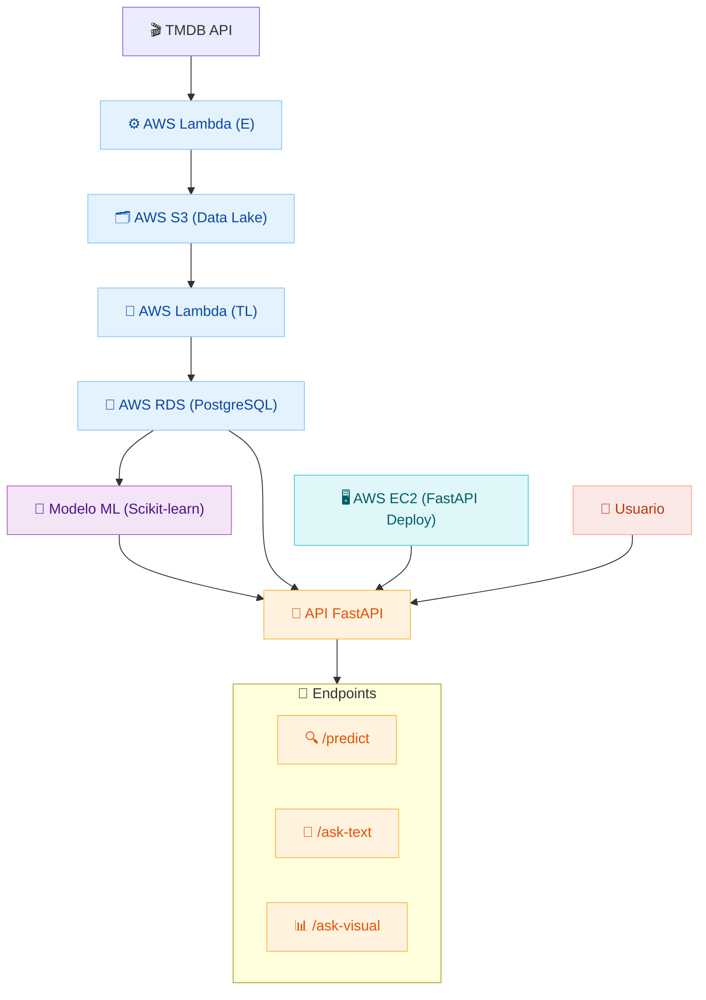

# 🎬 TMDB Movie Analysis API

Este proyecto implementa un pipeline completo de análisis de películas utilizando datos de [The Movie Database (TMDB)](https://www.themoviedb.org/), con una arquitectura en la nube, modelado predictivo y una API interactiva desplegada en AWS.

> 🧠 Nota: Aunque inicialmente se consideró Hugging Face para el procesamiento de lenguaje natural, finalmente se utilizó **Gemini IA** para los endpoints de preguntas y respuestas.

---

## 👥 Roles y Responsabilidades

### 🏗️ Data Architect
- Diseño de infraestructura en AWS: S3 (Data Lake), RDS (PostgreSQL), configuración de permisos y seguridad.

### ⚙️ Data Engineer
- Desarrollo de pipelines con AWS Lambda:
  - Extracción masiva y diaria desde la API de TMDB.
  - Carga y transformación de datos desde S3 hacia RDS.

### 🔬 Data Scientist
- Análisis de datos y definición de métricas de éxito.
- Entrenamiento de modelo de clasificación.
- Diseño de lógica para endpoints de preguntas y visualizaciones usando Gemini IA.

### 🚀 ML Engineer
- Desarrollo de la API con FastAPI.
- Despliegue en AWS EC2.
- Integración de endpoints predictivos, textuales y visuales.

---

## 📝 Fases del Proyecto

### **Fase 01: Infraestructura y Pipeline de Datos**

**Objetivo:** Automatizar la extracción y almacenamiento de datos de películas en la nube.

#### 🔧 Tareas Clave
- Extracción masiva inicial con AWS Lambda → S3.
- Extracción diaria con EventBridge → S3.
- Procesamiento automático desde S3 → PostgreSQL (RDS).

---

### **Fase 02: Modelado, API y Despliegue**

**Objetivo:** Crear una API inteligente que prediga el éxito de una película y responda preguntas complejas.

#### 🔧 Tareas Clave
- Entrenamiento de modelo de clasificación (Scikit-learn).
- Desarrollo de API con FastAPI:
  - `/predict`: Predicción de éxito de una película.
  - `/ask-text`: Preguntas en lenguaje natural → SQL → respuesta textual (usando Gemini IA).
  - `/ask-visual`: Preguntas visuales → SQL → gráfico (Matplotlib/Seaborn).

- Despliegue en AWS EC2.

---

## 🗺️ Arquitectura del Proyecto

El siguiente diagrama muestra el flujo completo de datos, procesamiento y despliegue de la API de análisis y predicción de éxito de películas:

### 🔎 Resumen del flujo

- **Extracción**: Datos de películas desde TMDB usando AWS Lambda.
- **Almacenamiento**: S3 como Data Lake, luego transformación hacia RDS.
- **Modelado**: Entrenamiento con Scikit-learn.
- **API**: FastAPI desplegada en EC2, con endpoints `/predict`, `/ask-text`, `/ask-visual`.
- **Interacción**: Usuario accede a la API para predicciones y consultas inteligentes vía Gemini IA.

---

## 🚀 Tecnologías Utilizadas

| Categoría         | Herramientas                          |
|-------------------|---------------------------------------|
| Cloud & Infra     | AWS (Lambda, S3, RDS, EC2, EventBridge) |
| Backend/API       | FastAPI, Uvicorn                      |
| Machine Learning  | Scikit-learn                          |
| NLP/Q&A           | Gemini IA                             |
| Visualización     | Matplotlib, Seaborn                   |
| Base de Datos     | PostgreSQL                            |
| Orquestación      | Git, GitHub                           |

---

## 📂 Estructura del Repositorio

Cada directorio contiene documentación con comentarios explicativos para facilitar la comprensión del flujo de trabajo.

| Carpeta / Archivo     | Descripción 📌                          |
|-----------------------|-----------------------------------------|
| `Base de Datos/`      | Scripts y estructura de la base de datos PostgreSQL |
| `ETL1/`               | Primer pipeline de extracción desde TMDB |
| `ETL2/`               | Segunda versión del pipeline con mejoras |
| `ETL final/`          | Versión final del pipeline ETL automatizado |
| `Modelo ML/`          | Entrenamiento y evaluación del modelo de clasificación |
| `movie-api/`          | Código de la API desarrollada con FastAPI |
| `.gitignore`          | Exclusión de archivos innecesarios en Git |
| `README.md`           | Documentación principal del proyecto |

---

## 📌 Estado Actual

✅ Infraestructura desplegada  
✅ Pipelines funcionando  
✅ Modelo entrenado  
✅ API operativa con endpoints `/predict`, `/ask-text`, `/ask-visual`  
✅ Despliegue en EC2  
✅ Documentación generada automáticamente por FastAPI

---

## 📬 Contacto

Proyecto desarrollado por [@natbm89](https://github.com/natbm89) y equipo.  
¿Tienes preguntas o sugerencias? ¡Abrimos issues y pull requests!
