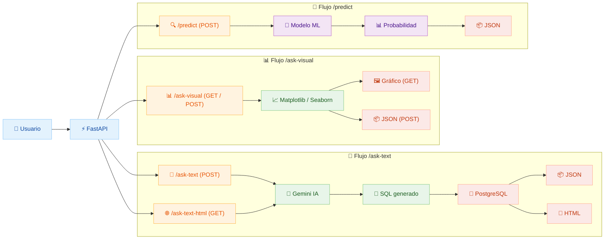

# Movie Database API


  🔗 [Demo en vivo](http://56.228.82.19:8000/demo)

API completa para consultas en lenguaje natural sobre películas con generación automática de visualizaciones y predicciones de éxito usando Machine Learning.

## Características Principales

- **NL2SQL con Gemini AI**: Convierte preguntas en español a consultas SQL usando Google Gemini
- **Visualizaciones automáticas**: Gráficos generados dinámicamente con Matplotlib/Seaborn
- **Predicción ML**: Modelo de Machine Learning para predecir el éxito de películas
- **Base de datos PostgreSQL** en AWS RDS con 1,200,000+ películas
- **Interfaz web interactiva** con Swagger UI y documentación completa
- **Cloud-ready**: Desplegable en AWS EC2 con configuración automatizada
- **Página de inicio amigable**: Muestra los endpoints disponibles, las tecnologías utilizadas y acceso directo a ejemplos reales de uso

## Endpoints Disponibles

| Endpoint | Método | Descripción | Estado |
|----------|--------|-------------|--------|
| `/ask-text-html` | GET | Respuestas HTML formateadas | Funcionando |
| `/ask-text` | POST | Respuestas JSON estructuradas | Funcionando |
| `/ask-visual` | GET | Gráficos automáticos | Funcionando |
| `/ask-visual` | POST | Datos del gráfico JSON | Funcionando |
| `/predict` | POST | Predicción de éxito de películas | Funcionando |
| `/predict/health` | GET | Estado del modelo ML (cargado/disponible) | Funcionando |
| `/health` | GET | Estado general de la API | Funcionando |
| `/demo` | GET | Página de demostración HTML | Funcionando |
| `/docs` | GET | Documentación interactiva | Funcionando |

## Instalación Rápida

### Entorno virtual venv (Recomendado para AWS EC2)
```bash
# Clonar repositorio
git clone https://github.com/natbm89/tmdb.git
cd tmdb/movie-api

# Crear entorno virtual
python3.11 -m venv venv
source venv/bin/activate

# Instalar dependencias
pip install -r requirements.txt

# Configurar variables de entorno
nano .env

# Ejecutar aplicación
uvicorn app.main:app --reload --host 0.0.0.0 --port 8000
```

## Configuración

### Variables de entorno (.env)
```env
# Requeridas
DB_KEY=tu-secret-key-aws
AWS_REGION=tu-region-aws
GEMINI_API_KEY=tu-gemini-api-key
```

## Uso y Ejemplos

### 1. Consultas de Texto
```bash
# Respuesta HTML visual
GET /ask-text-html?question=¿Top 5 películas mejor valoradas?

# Respuesta JSON estructurada
POST /ask-text
Content-Type: application/json
{
  "question": "¿Cuántas películas de comedia hay?"
}
```

### 2. Visualizaciones Automáticas
```bash
# Gráfico de barras
GET /ask-visual?question=¿Distribución de géneros?&format=image

# Datos del gráfico en JSON
POST /ask-visual?question=¿Top 10 películas populares?&format=json
```


### 3. Predicciones ML
```bash
# Predecir éxito de película (ejemplo con features principales)
POST /predict
Content-Type: application/json
{
  "titulo": "Avatar: The Way of Water",
  "duracion": 180,
  "vote_count": 10000,
  "budget": 250000000,
  "popularity": 80.5,
  "true_revenue": 2000000000,
  "true_budget": 250000000,
  "Action": 1,
  "Science Fiction": 1,
  "Adventure": 1,
  "original_language_en": 1,
  "status_Released": 1
  // ...puedes agregar más features según tu caso
}

# Verificar estado del modelo ML
GET /predict/health

Respuesta ejemplo:
```json
{
  "status": "ok",
  "message": "Modelo de éxito cargado correctamente",
  "model_available": true,
  "model_path": "app/models/model_rf.pkl"
}
```

## Arquitectura del Proyecto

```
movie_app/
├── app/
│   ├── endpoints/
│   │   ├── ask_text.py       # Consultas NL2SQL
│   │   ├── ask_visual.py     # Generación de gráficos
│   │   └── predict.py        # Predicciones
│   ├── models/
│   │   ├── sql_predictor.py  # Ejecución de consultas SQL
│   │   ├── model_rf.pkl      # Modelo RandomForest entrenado
│   │   ├── scaler_rf.pkl     # Scaler del modelo
│   │   ├── model_features.json # Features del modelo
│   ├── utils/
│   │   ├── sql_converter.py  # Conversión NL2SQL con Gemini
│   ├── tests/                # Pruebas unitarias y de integración
│   ├── config.py             # Configuración AWS y BD
│   └── main.py               # Aplicación principal FastAPI
├── requirements.txt          # Dependencias actualizadas
├── DEPLOYMENT.md             # Guía de despliegue AWS
├── API_DOCUMENTATION.md      # Documentación técnica
└── README.md                 # Este archivo
```
## Diagrama de Arquitectura



## Stack Tecnológico

### Backend & API
- **FastAPI 0.104+**: Framework web moderno y rápido
- **Uvicorn**: Servidor ASGI de alto rendimiento
- **Pydantic 2.5+**: Validación de datos robusta

### Machine Learning & NLP
- **Google Gemini AI**: Motor NL2SQL de última generación
- **scikit-learn 1.4+**: Modelo de predicción de éxito

### Base de Datos
- **PostgreSQL en AWS RDS**: Base de datos relacional
- **psycopg3**: Driver optimizado
- **1,200,000+ películas**: Dataset de TMDB

### Visualización
- **Matplotlib 3.8+**: Gráficos estáticos profesionales
- **Seaborn 0.13+**: Visualizaciones estadísticas avanzadas
- **Pandas/Numpy**: Análisis y manipulación de datos

### Cloud & DevOps
- **AWS EC2**: Hosting escalable
- **AWS Secrets Manager**: Gestión segura de credenciales
- **Conda**: Gestión de entornos reproducibles


## Ejemplos de Consultas

### Preguntas soportadas:
- **Rankings**: "¿Top 10 películas mejor valoradas?"
- **Conteos**: "¿Cuántas películas de acción hay?"
- **Géneros**: "¿Qué géneros están disponibles?"
- **Filtros**: "¿Películas con presupuesto mayor a 100M?"
- **Comparaciones**: "¿Rating promedio por género?"

### Visualizaciones generadas:
- **Gráficos de barras**: Rankings y comparaciones
- **Gráficos circulares**: Distribuciones de géneros
- **Scatter plots**: Relaciones presupuesto vs rating
- **Histogramas**: Distribuciones de ratings

### Predicciones ML:
- **Entrada**: JSON con el título y todas las features requeridas por el modelo (ver ejemplo arriba).
- **Salida**: Probabilidad de éxito (0.0 - 1.0)
- **Interpretación**: Alto/Medio/Bajo potencial
- **Nota**: Si omites features, se rellenan con 0 automáticamente, pero la predicción será más precisa si envías todos los datos posibles.

## Limitaciones Conocidas

### Datos NO disponibles:
- Directores y actores específicos
- Información de streaming/plataformas


## Despliegue

Ver [DEPLOYMENT.md](DEPLOYMENT.md) para instrucciones completas de despliegue en AWS EC2.

## Documentación

- **API Interactiva**: `/docs` (Swagger UI)
- **API Alternativa**: `/redoc` (ReDoc)
- **Documentación técnica**: [API_DOCUMENTATION.md](API_DOCUMENTATION.md)

## Licencia

Proyecto académico - Hack a Boss (2025)

---

**Estado del proyecto**: Finalizado 
**Última actualización**: Agosto 2025  

**Versión**: 2.0.1
